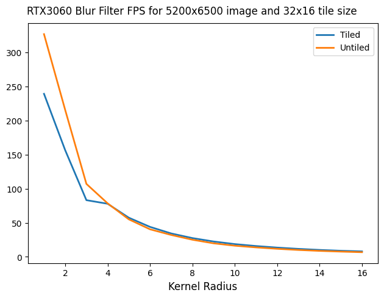

# GPU Image Performance Tiles Test

CUDA Convolution test comparing image tiled and untiled blur filters.


**Run the demo**
<p>This demo can be build for Windows and Linux.

**Windows**
<br>(1) Use the Visual Studio solution.
<br>(2) CMake
<br>Create folder <b>build_windows</b> 
<br>cmake ../ 
<br>cmake ../ -G "Visual Studio 15 2017"

**Linux**
<br>Create folder <b>build_linux</b> .
<br>cmake ../
<br>make

Requirements:
<br>CUDA Toolkit
<br>CMake (>=3.26)

# Results

Typical output:

```
Filter: 7 x 7
image size: 5200 x 6500
filter                                  time                FPS
---------------------------------------------------------------------
gauss_gpu_tiles                         9.57 [ms]           104.49
gauss_gpu                               8.82 [ms]           113.38
```

## Untiled image filter

```cpp
__global__ void conv_kernel(const float* __restrict__ in, float * __restrict__ out, int w, int h)
{
    unsigned int idx = blockIdx.x*blockDim.x + threadIdx.x;
    unsigned int y = blockIdx.y*blockDim.y + threadIdx.y;
    unsigned int x = idx % w;
    unsigned int c = idx / w;   
    unsigned int w3 = 3 * w;

    if ((idx >= w3) || (y >= h))
        return;

    unsigned int id = y * w3 + c*w + x;   // image index RGB/NCWH

    if (x <= R-1 || y <= R-1 || x >= w-R || y >= h-R)
    {
        out[id] = in[id];
        return;
    }
    
    float sum = 0;
    for(int i = -R; i <=R; i++)
    for(int j = -R; j <=R; j++)
    {
        sum += in[id + j + w3*i] *kernel_blur[(i + R) * D + (j + R)];
    }

    out[id] = sum;
}
```

## Tiled image filter


```cpp
__global__ void conv_tiles_kernel(const float* __restrict__ in, float * __restrict__ out, int w, int h)
{
    const int BLOCK_W = (TILE_W + 2*R);
    const int BLOCK_H = (TILE_H + 2*R);
    __shared__ float smem[BLOCK_H][BLOCK_W];

    int tx = threadIdx.x;
    int ty = threadIdx.y;
    unsigned int idx = blockIdx.x*blockDim.x+threadIdx.x;
    unsigned int idy = blockIdx.y*blockDim.y+threadIdx.y;

    unsigned int x = idx % w;
    unsigned int c = idx / w;
    unsigned int y = idy;

    int w3 = w * 3;
    int idx_out = y * w3 + c * w + x;

    // load central block
    smem[ty+R][tx+R] = in[idx_out]; 
    // load left bar
    if ((x >= R) && (tx < R)) smem[ty+R][tx] = in[idx_out-R];
    // load right bar
    if ((x < w-R) && (tx >= blockDim.x-R) ) smem[ty+R][tx+2*R] = in[idx_out+R];
    // load top bar
    if ((y > R-1) && (ty < R)) smem[ty][tx+R] = in[idx_out-R*w3];
    // load bottom bar
    if ((y < h-R) && (ty >=blockDim.y-R)) smem[ty+2*R][tx+R] = in[idx_out+R*w3];
    // load UL corner
    if ((x > R-1) && (y > R-1) && (tx < R) && (ty < R)) smem[ty][tx] = in[idx_out - R*w3 - R];
    // load UR corner
    if ((x < w-R) && (y > R-1) && (tx >= blockDim.x-R) && (ty < R) ) smem[ty][tx+2*R] = in[idx_out - R * w3 + R];
    // load LL corner
    if ((x > R-1) && (y < h-R) && (tx < R) && (ty >= blockDim.y-R) ) smem[ty+2*R][tx] = in[idx_out + R * w3 - R];
    // load LR corner
    if ((x < w-R) && (y < h-R) && (tx >=blockDim.x-R) && (ty >= blockDim.y-R)) smem[ty+2*R][tx+2*R] = in[idx_out + R * w3 + R];
    
    __syncthreads();

    if (x <= R-1 || y <= R-1 || x >= w-R || y >= h-R)
    {
        out[idx_out] = in[idx_out];
        return;
    }

    float sum = 0;
    for(int i = -R; i <=R; i++)
    for(int j = -R; j <=R; j++)
    {
        sum += smem[ty+R+i][tx+R+j] * kernel_blur[(i+R)*D+(j+R)];
    }
    out[idx_out] = sum;
}
```
# Benchmark comparison

The figure below shows the comparison of the tiled and untiled CUDA convolution image filter for kernel radius between 1-16.


<p align="center">
  
</p>

These results shows that tiled implementation with CUDA, using effectively the shared memory is accually not better for filter size less than 11 x 11. For detailed discussion [<b>See</b>.](https://forums.developer.nvidia.com/t/how-to-use-more-efficiently-the-shared-memory-and-2d-tiles/253551/2)


